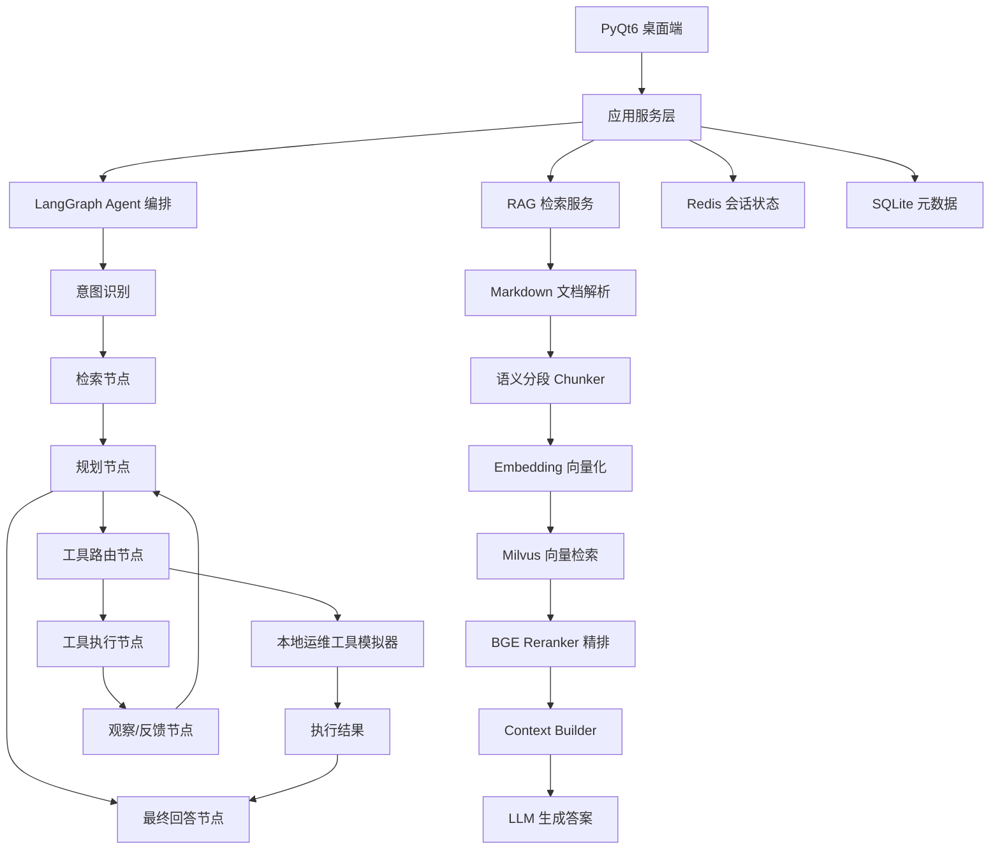
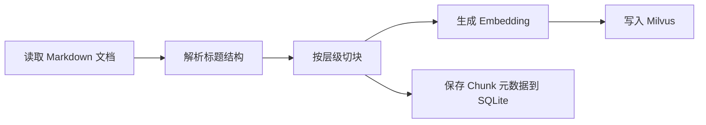
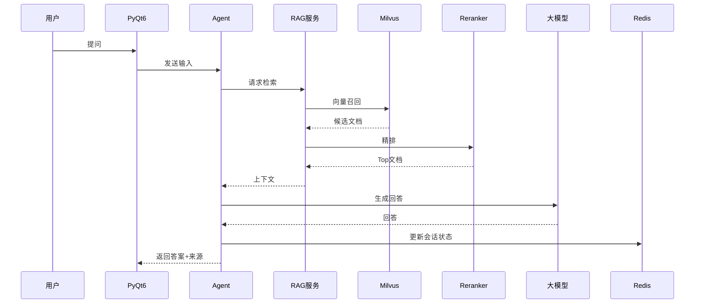
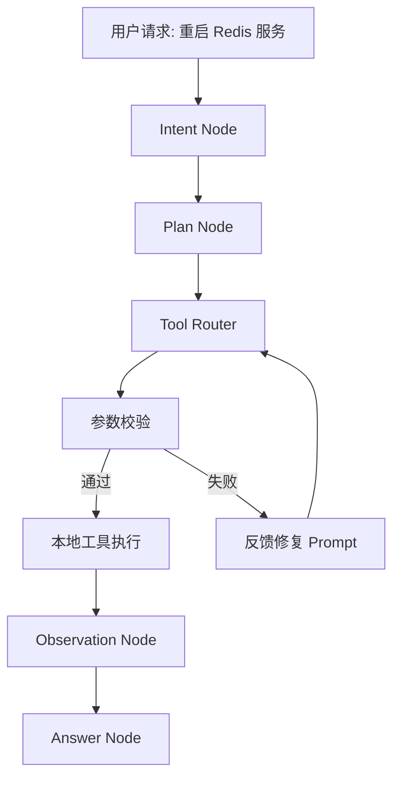
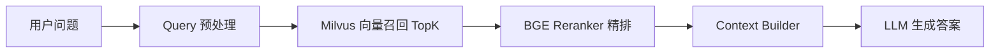
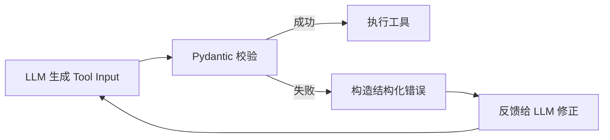
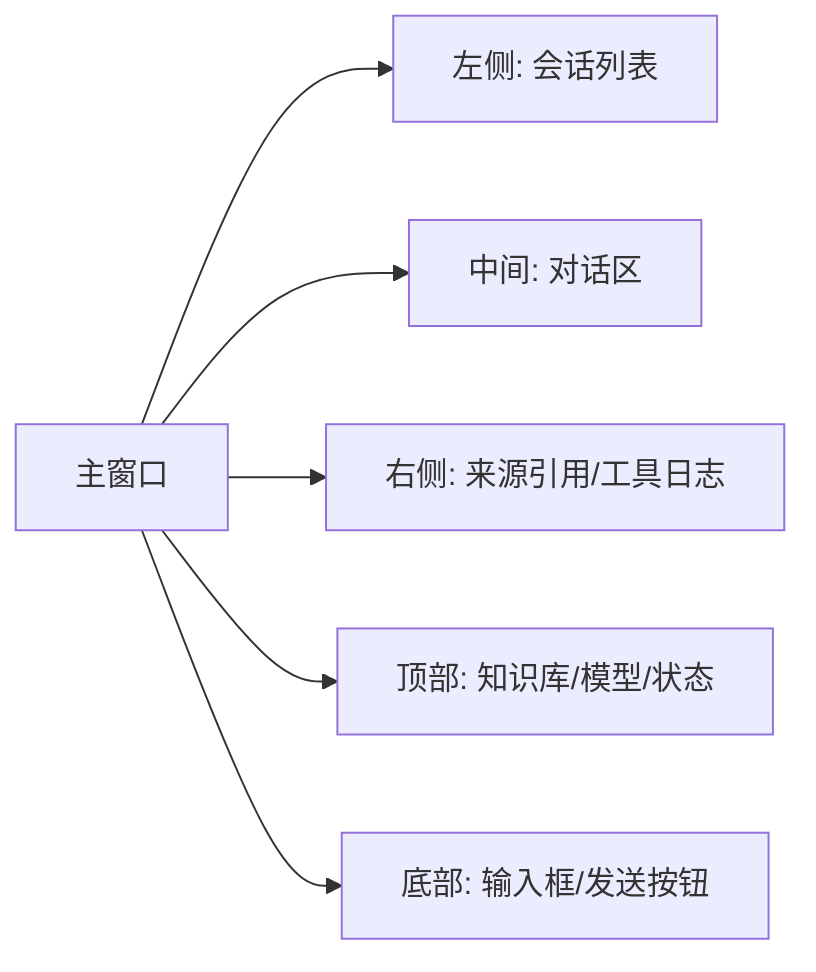

# 企业级智能运维与研发知识自动化平台

## 单机最小落地版架构与实现方案

> 目标：先实现一个单机可运行、可演示、可写入简历的 MVP 版本。  
> 技术栈：`Python + LangGraph + LangChain + RAG + Redis + PyQt6 + SQLite + Milvus`

---

## 1. 项目定位

这个项目的最小落地版本，不追求一开始就覆盖企业级全部能力，而是优先完成一条可以真实演示的闭环：

1. 导入本地技术文档
2. 建立向量索引
3. 实现技术问答
4. 基于 Agent 调用本地模拟工具完成运维动作
5. 保存会话上下文
6. 在 PyQt6 桌面端可视化展示

这个版本的核心价值不是“大而全”，而是：

- 能跑通 RAG 问答
- 能展示 Agent 自动化流程
- 能体现长对话优化思路
- 能支撑后续扩展成企业级平台

---

## 2. 单机 MVP 总体架构



---

## 3. 单机 MVP 的设计边界

### 3.1 In Scope

- 本地 Markdown 技术文档导入
- Milvus 向量检索
- BGE-Reranker 精排
- LangGraph 多节点 Agent
- 本地模拟运维工具调用
- Redis 会话记忆
- PyQt6 桌面演示界面
- SQLite 持久化会话与文档元数据

### 3.2 Out of Scope

- 企业统一登录
- 真实生产环境高危命令执行
- 多租户权限系统
- 集群化部署
- 海量并发处理
- 完整审批流

---

## 4. 为什么先做单机版

| 目标 | 单机版价值 |
|---|---|
| 简历项目可讲清楚 | 可以完整展示从知识检索到 Agent 自动化闭环 |
| 开发复杂度可控 | 先解决核心链路，不被分布式和权限系统拖住 |
| 便于演示 | 本地就能演示导入文档、提问、检索、调用工具 |
| 容易逐步升级 | 后续可平滑替换 SQLite、工具执行层、鉴权层 |

---

## 5. 推荐项目目录结构

```text
AI_Agent_First/
  app/
    main.py
    config/
      settings.py
      logging.py
    core/
      constants.py
      exceptions.py
    models/
      document.py
      message.py
      session.py
      tool_result.py
    rag/
      markdown_parser.py
      chunker.py
      embedding_service.py
      vector_store.py
      reranker.py
      retriever.py
      context_builder.py
      ingest_pipeline.py
    agent/
      graph.py
      state.py
      prompts.py
      nodes/
        intent_node.py
        retrieve_node.py
        plan_node.py
        tool_router_node.py
        tool_exec_node.py
        answer_node.py
        summary_node.py
    tools/
      base.py
      registry.py
      ops_tools.py
      validators.py
    services/
      llm_service.py
      session_service.py
      summary_service.py
      document_service.py
    repositories/
      sqlite_repo.py
    ui/
      main_window.py
      pages/
        chat_page.py
        docs_page.py
        logs_page.py
      widgets/
        message_bubble.py
        source_card.py
        tool_log_panel.py
  data/
    docs/
    cache/
    sqlite/
  scripts/
    ingest_docs.py
    run_demo.py
  README.md
```

---

## 6. 核心模块拆解

### 6.1 文档接入模块

职责：

- 扫描本地 Markdown 文档
- 提取标题层级
- 基于语义切块
- 写入 Milvus
- 保存元数据到 SQLite

建议输入目录：

```text
data/docs/
  redis/
  mysql/
  kubernetes/
  incidents/
```

### 6.2 RAG 检索模块

职责：

- 对用户问题做预处理
- 向量召回
- reranker 精排
- 上下文组装
- 返回可被 LLM 消费的高质量 context

### 6.3 Agent 编排模块

职责：

- 判断用户是在问知识、要排障，还是要执行操作
- 决定是否进入工具调用
- 将检索结果和工具结果融合
- 输出最终回答

### 6.4 会话记忆模块

职责：

- Redis 保存最近若干轮消息
- 保存会话摘要
- 降低长对话 token 成本

### 6.5 PyQt6 演示界面

职责：

- 输入问题
- 展示回答
- 展示引用来源
- 展示工具执行过程
- 切换会话

---

## 7. 数据流说明

### 7.1 文档入库流程



### 7.2 用户问答流程



### 7.3 Agent 工具执行流程



---

## 8. 单机 MVP 的功能优先级

| 优先级 | 功能 | 说明 |
|---|---|---|
| P0 | Markdown 文档导入 | 没有知识库，RAG 无法工作 |
| P0 | Milvus 检索 + Rerank | 决定问答质量 |
| P0 | LangGraph 基础 Agent | 决定是否能展示自动化链路 |
| P0 | PyQt6 聊天主界面 | 决定是否能完整演示 |
| P1 | Redis 会话记忆 | 支撑多轮对话和成本优化 |
| P1 | 本地模拟运维工具 | 用于演示 Tool Calling 与 ReAct |
| P2 | 摘要压缩 | 用于体现长对话优化亮点 |
| P2 | 引用来源高亮 | 增强演示效果和可信度 |

---

## 9. 本地最小实现建议

### 9.1 文档源

先只接 Markdown，原因：

- 易解析
- 能保留标题层级
- 适合做层级切块
- 容易构造演示数据

### 9.2 工具执行层

先不要直接接真实生产 API，建议做本地模拟工具：

- `check_service_status`
- `search_error_logs`
- `restart_mock_service`
- `get_incident_summary`

这样既能展示 Agent 自动化能力，又避免高风险。

### 9.3 数据存储

| 数据类型 | 技术 |
|---|---|
| 向量数据 | Milvus |
| 会话状态 | Redis |
| 文档元数据/聊天记录 | SQLite |

---

## 10. 核心数据模型

### 10.1 Chunk 模型

```python
from pydantic import BaseModel
from typing import List


class DocumentChunk(BaseModel):
    doc_id: str
    chunk_id: str
    title: str
    section_path: List[str]
    content: str
    source: str
    tags: List[str] = []
    order: int
    token_count: int
```

### 10.2 Agent State

```python
from typing import TypedDict, List, Dict, Any


class AgentState(TypedDict, total=False):
    session_id: str
    user_query: str
    rewritten_query: str
    intent: str
    retrieved_docs: List[Dict[str, Any]]
    context_text: str
    selected_tool: str
    tool_input: Dict[str, Any]
    tool_output: Dict[str, Any]
    observations: List[str]
    final_answer: str
    summary: str
    retry_count: int
    error: str
```

### 10.3 Tool Result

```python
from pydantic import BaseModel
from typing import Any


class ToolResult(BaseModel):
    success: bool
    code: str
    message: str
    data: Any = None
    retryable: bool = False
```

---

## 11. Markdown 层级切块实现建议

目标：解决长文档切块后语义断裂问题。

策略：

1. 先按 `# / ## / ###` 建立章节树
2. 每块保留父级标题路径
3. 每个 chunk 控制在 300 到 600 tokens
4. 对超长段落二次切块
5. 代码块和命令块整体保留
6. 相邻 chunk 保留 50 到 80 tokens overlap

### 核心代码示例

```python
import re
from dataclasses import dataclass, field


@dataclass
class Section:
    title: str
    level: int
    content: list[str] = field(default_factory=list)
    path: list[str] = field(default_factory=list)


def split_markdown_sections(text: str) -> list[Section]:
    sections: list[Section] = []
    current = Section(title="ROOT", level=0, path=[])

    for line in text.splitlines():
        match = re.match(r"^(#{1,6})\s+(.+)$", line)
        if match:
            if current.content:
                sections.append(current)
            level = len(match.group(1))
            title = match.group(2).strip()
            path = current.path[: level - 1] + [title]
            current = Section(title=title, level=level, path=path, content=[])
        else:
            current.content.append(line)

    if current.content:
        sections.append(current)

    return sections
```

---

## 12. RAG 检索链路设计

### 12.1 检索链路



### 12.2 检索参数建议

| 参数 | 建议值 |
|---|---|
| 向量召回 top_k | 15 到 20 |
| rerank 输入数 | 10 到 15 |
| 最终上下文块数 | 4 到 6 |
| chunk 大小 | 300 到 600 tokens |
| overlap | 50 到 80 tokens |

### 12.3 检索伪代码

```python
def retrieve(query: str):
    rewritten = rewrite_query(query)
    candidates = milvus_search(rewritten, top_k=20)
    ranked = rerank(query, candidates)
    top_docs = ranked[:5]
    context = build_context(top_docs)
    return context, top_docs
```

---

## 13. LangGraph Agent 设计

### 13.1 节点划分

| 节点 | 作用 |
|---|---|
| `intent_node` | 判断用户问题属于问答、排障还是执行 |
| `retrieve_node` | 执行 RAG 检索 |
| `plan_node` | 规划下一步行为 |
| `tool_router_node` | 判断是否需要调用工具 |
| `tool_exec_node` | 执行工具 |
| `answer_node` | 生成最终答案 |
| `summary_node` | 更新会话摘要 |

### 13.2 Graph 代码骨架

```python
from langgraph.graph import StateGraph, END


def build_graph():
    graph = StateGraph(AgentState)

    graph.add_node("intent", intent_node)
    graph.add_node("retrieve", retrieve_node)
    graph.add_node("plan", plan_node)
    graph.add_node("tool_router", tool_router_node)
    graph.add_node("tool_exec", tool_exec_node)
    graph.add_node("answer", answer_node)
    graph.add_node("summary", summary_node)

    graph.set_entry_point("intent")
    graph.add_edge("intent", "retrieve")
    graph.add_edge("retrieve", "plan")
    graph.add_conditional_edges(
        "plan",
        should_call_tool,
        {
            "tool": "tool_router",
            "answer": "answer",
        },
    )
    graph.add_edge("tool_router", "tool_exec")
    graph.add_edge("tool_exec", "answer")
    graph.add_edge("answer", "summary")
    graph.add_edge("summary", END)

    return graph.compile()
```

---

## 14. Tool Calling 参数自修复机制

这个模块是项目亮点，建议单机版就做。

### 14.1 问题背景

LLM 选择工具时，常见失败点：

- 参数字段名错误
- 字段类型错误
- 缺少必填参数
- 字段语义不完整

### 14.2 自修复闭环



### 14.3 核心代码示例

```python
from pydantic import BaseModel, ValidationError


class RestartServiceInput(BaseModel):
    service_name: str
    namespace: str = "default"


def validate_tool_input(raw_args: dict):
    try:
        return True, RestartServiceInput(**raw_args).model_dump(), None
    except ValidationError as exc:
        return False, None, {
            "error_type": "validation_error",
            "details": exc.errors(),
        }
```

---

## 15. Redis 会话记忆设计

### 15.1 Redis 中保存什么

| Key | 作用 |
|---|---|
| `session:{id}:messages` | 最近几轮对话 |
| `session:{id}:summary` | 历史摘要 |
| `session:{id}:tool_history` | 工具调用历史 |

### 15.2 策略

- 保留最近 6 到 10 轮原始消息
- 更早消息压缩成摘要
- 摘要内容包含：用户目标、已完成步骤、关键结论、未解决问题

### 15.3 核心代码示例

```python
import json


class SessionService:
    def __init__(self, redis_client):
        self.redis = redis_client

    def append_message(self, session_id: str, role: str, content: str):
        key = f"session:{session_id}:messages"
        self.redis.rpush(key, json.dumps({"role": role, "content": content}, ensure_ascii=False))
        self.redis.ltrim(key, -10, -1)

    def get_recent_messages(self, session_id: str):
        key = f"session:{session_id}:messages"
        items = self.redis.lrange(key, 0, -1)
        return [json.loads(i) for i in items]
```

---

## 16. SQLite 建议存储内容

| 表名 | 用途 |
|---|---|
| `documents` | 文档信息 |
| `document_chunks` | chunk 元数据 |
| `chat_sessions` | 会话 |
| `chat_messages` | 历史消息 |
| `tool_logs` | 工具调用日志 |

### 建表示例

```sql
CREATE TABLE IF NOT EXISTS documents (
    id TEXT PRIMARY KEY,
    title TEXT NOT NULL,
    source TEXT,
    path TEXT,
    created_at TEXT,
    updated_at TEXT
);

CREATE TABLE IF NOT EXISTS tool_logs (
    id TEXT PRIMARY KEY,
    session_id TEXT,
    tool_name TEXT,
    input_json TEXT,
    output_json TEXT,
    status TEXT,
    created_at TEXT
);
```

---

## 17. PyQt6 演示界面设计

### 17.1 页面结构



### 17.2 MVP 页面功能

| 区域 | 功能 |
|---|---|
| 左侧 | 展示会话历史 |
| 中间 | 展示问答消息 |
| 右侧 | 展示命中文档和工具执行日志 |
| 底部 | 输入问题并发送 |

---

## 18. 建议先实现的 4 个演示场景

| 场景 | 演示内容 |
|---|---|
| 知识问答 | 输入 Redis 故障问题，返回准确答案和文档来源 |
| 故障分析 | 输入报错日志，Agent 结合文档给出诊断建议 |
| 工具调用 | 让 Agent 调用模拟工具查询服务状态 |
| 长对话压缩 | 多轮对话后仍保持上下文连贯，并显示 token 优化思路 |

---

## 19. 开发顺序建议

### 第一阶段：搭骨架

1. 初始化目录结构
2. 配置 `settings.py`
3. 跑通 Redis / SQLite / Milvus 连接
4. 实现文档 ingest 脚本

### 第二阶段：完成 RAG

1. Markdown 解析
2. chunk 切分
3. embedding 生成
4. 向量检索
5. reranker 精排
6. context builder

### 第三阶段：完成 Agent

1. 定义 `AgentState`
2. 实现 intent / retrieve / plan / answer 节点
3. 增加本地工具模拟器
4. 增加参数校验和自修复

### 第四阶段：完成 UI

1. 聊天主界面
2. 引用卡片
3. 工具日志面板
4. 会话列表

### 第五阶段：增强演示效果

1. Redis 会话记忆
2. 摘要压缩
3. 日志统计面板
4. Demo 脚本

---

## 20. 最容易踩坑的问题与预防

### 20.1 检索效果差

原因：

- 切块太粗
- 标题层级丢失
- 召回结果噪音大

预防：

- 强制保留 `section_path`
- chunk 长度保持稳定
- 加 reranker
- 返回答案时必须附来源

### 20.2 Agent 工具调用不稳定

原因：

- Prompt 太自由
- 参数 schema 不清晰
- 工具输出结构不统一

预防：

- 给每个工具明确输入模型
- 统一 `ToolResult`
- 参数校验失败时返回结构化错误

### 20.3 多轮对话成本失控

原因：

- 历史消息无限堆积
- 每轮都塞满全部上下文

预防：

- recent messages + summary 双层记忆
- 控制 context chunk 数量
- 只保留最近 10 轮原始消息

### 20.4 PyQt6 界面卡顿

原因：

- 网络请求阻塞主线程
- 工具执行与 UI 绘制串行

预防：

- 后台线程执行 LLM / 检索 / 工具调用
- 使用 signal/slot 更新界面

### 20.5 演示失败

原因：

- 外部依赖过多
- 环境切换复杂
- 文档和模型没准备好

预防：

- 先准备固定 demo 数据集
- 先用本地模拟工具
- 写一个 `scripts/run_demo.py`

---

## 21. 演示时推荐的话术

可以按下面这条线介绍：

1. 这是一个面向企业研发和运维知识场景的智能自动化平台
2. 核心能力是用 RAG 提升技术文档问答准确率
3. 用 LangGraph 构建多步推理 Agent，实现知识检索到运维工具调用闭环
4. 用 Redis 做多轮会话状态管理，并通过摘要压缩降低上下文成本
5. 当前版本是单机可演示 MVP，但架构已预留企业级扩展空间

---

## 22. 第一版必须完成的文件

| 文件 | 作用 |
|---|---|
| `app/config/settings.py` | 统一配置 |
| `app/rag/chunker.py` | 文档切块 |
| `app/rag/retriever.py` | 检索逻辑 |
| `app/agent/graph.py` | LangGraph 编排 |
| `app/tools/ops_tools.py` | 本地工具模拟 |
| `app/services/session_service.py` | Redis 会话管理 |
| `app/ui/main_window.py` | PyQt6 主界面 |
| `scripts/ingest_docs.py` | 文档入库脚本 |

---

## 23. MVP 验收标准

| 项目 | 验收标准 |
|---|---|
| 文档入库 | 能成功读取并切分本地 Markdown 文档 |
| 检索效果 | 关键问题能命中正确文档片段 |
| Agent 编排 | 能根据问题判断是否调用工具 |
| Tool Calling | 模拟工具能正常执行并返回结构化结果 |
| 会话记忆 | 多轮对话能保留上下文 |
| UI 展示 | 能看到回答、来源、工具日志 |
| 可演示性 | 能完成至少 3 个稳定场景演示 |

---

## 24. 后续升级方向

MVP 跑通后，再逐步升级：

1. SQLite 升级 PostgreSQL
2. 本地模拟工具升级企业内部 API
3. 单一知识库升级多知识库隔离
4. 简单记忆升级结构化长期记忆
5. 本地桌面端升级 Web 管理台

---

## 25. 一句话总结

这个单机 MVP 的核心不是“做一个聊天窗口”，而是验证一条完整的企业知识自动化链路：

**文档解析 -> 检索增强 -> LangGraph Agent 推理 -> 工具调用 -> 会话记忆 -> 桌面端可视化展示**

只要这条链路打通，这个项目就已经具备了很强的演示价值、简历价值和后续扩展价值。
