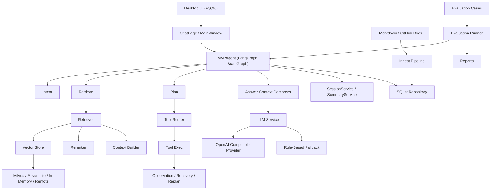

# AI Agent First

`AI Agent First` 是一个本地桌面端 AI Agent MVP，目标不是只做“能跑通的骨架”，而是把知识库、RAG、Agent、工具执行、真实大模型调用、桌面端交互和评测闭环真正接起来。

当前仓库已经具备真实可运行能力：

- 本地 Markdown 文档入库与 SQLite 持久化
- `in-memory / milvus / milvus-lite / remote` 检索后端
- `keyword / bge` reranker
- 基于 LangGraph 的状态驱动 Agent
- 受控真实工具适配器与 mock fallback
- OpenAI-compatible LLM 接入与 SSE 流式输出
- 桌面端可视化交互、provider 诊断、RAG 阶段耗时与会话摘要展示
- GitHub 数据集构建、评测集与报告导出

## 当前能力概览

### RAG

- 支持 `Markdown -> parser -> chunk -> SQLite` 入库链路
- 支持 `milvus / milvus-lite / in-memory / remote` 向量召回
- 支持 `keyword-tech-weighted` 与 `BGE` 重排
- 支持 `retrieval / coarse_rerank / bge_rerank / context_build` 四段耗时遥测
- 支持来源引用与上下文长度控制

### LangGraph Agent

- 已从顺序式编排器升级为真实 `LangGraph StateGraph`
- 使用统一 `AgentState` 贯穿整条执行链路
- 支持三类主路径：
  - `knowledge -> retrieve -> answer`
  - `troubleshoot -> retrieve -> diagnose -> answer`
  - `execute -> tool_router -> tool_exec -> observation/recovery/replan -> answer`
- 支持 `node_trace / plan_route / plan_steps / tool_actions / recovery_action / replan_steps` 可观测输出

### 工具层

- 保留 registry 机制，但已升级为“受控真实适配器 + mock fallback”
- 工具结果统一结构化输出：
  - `success`
  - `message`
  - `data`
  - `retryable`
  - `error_code`
  - `diagnostics`
- 已落地的低风险适配器：
  - `check_service_status`
  - `search_error_logs`
  - `restart_mock_service`（默认 dry-run）
  - `get_incident_summary`

### LLM

- 支持 OpenAI-compatible `/chat/completions`
- 支持配置模型，例如 `gpt-5.2`
- 支持真实 `stream=true` SSE 流式输出
- 支持 timeout / disconnect / `HTTP 401` / `HTTP 429` / `HTTP 5xx` 诊断
- 支持自动重试与退避
- 未配置远程模型时自动回退到本地规则回答

### Desktop UI

- 左侧展示知识库摘要，而不是原始文件清单
- 中间展示会话区、输入区、流式回答
- 右侧展示：
  - provider diagnostics
  - 首包延迟 / 总耗时
  - RAG 四段耗时
  - 当前会话摘要
  - 来源引用
  - 工具日志
- 支持取消请求、超时提示、重试按钮
- 窗口默认居中启动

### 评测与验收

- 支持从 GitHub 高信号问题构建知识文档
- 支持生成测试集与离线评测报告
- 支持 `JSON / Markdown` 报告导出
- 仓库内已包含真实验收记录和阶段结果

## 当前架构概览



## 目录结构

- `app/`
  核心源码，包含 `agent / rag / services / repositories / tools / ui / evaluation / validation`
- `data/docs/`
  本地知识库与采集整理后的 Markdown 文档
- `data/sqlite/`
  SQLite 运行时数据
- `data/milvus/`
  Milvus Lite 运行时数据
- `docs/`
  架构与执行说明文档
- `evaluation/`
  评测集与评测报告
- `results/`
  真实验收记录
- `scripts/`
  启动、入库、评测、验证脚本
- `tests/`
  单测、集成测试、UI 行为测试

## 快速开始

### 1. 安装基础依赖

```bash
python -m pip install -e .
python -m pip install -e .[rag]
```

如果只想先运行桌面端，至少需要：

```bash
python -m pip install PyQt6
```

### 2. 运行测试与运行时校验

```bash
python -m unittest discover -s tests -v
python scripts/validate_runtime.py
```

### 3. 导入知识库

```bash
python scripts/ingest_docs.py
```

### 4. 启动桌面端

```bash
python scripts/run_desktop.py
```

### 5. CLI 快速查看运行状态

```bash
python -m app.main
```

### 6. 运行演示或评测

```bash
python scripts/run_demo.py
python scripts/run_eval.py
```

## 环境变量

### LLM

```bash
set AI_AGENT_FIRST_LLM_API_KEY=你的APIKey
set AI_AGENT_FIRST_LLM_BASE_URL=https://api.openai.com/v1
set AI_AGENT_FIRST_LLM_MODEL=gpt-5.2
set AI_AGENT_FIRST_LLM_TIMEOUT_SECONDS=30
set AI_AGENT_FIRST_LLM_RETRY_ATTEMPTS=2
set AI_AGENT_FIRST_LLM_RETRY_BACKOFF_SECONDS=0.4
set AI_AGENT_FIRST_LLM_CONTEXT_MAX_CHARS=1400
```

也兼容：

```bash
set OPENAI_API_KEY=你的APIKey
```

### Retrieval / RAG

```bash
set AI_AGENT_FIRST_RETRIEVAL_BACKEND=milvus-lite
set AI_AGENT_FIRST_EMBEDDING_BACKEND=hash
set AI_AGENT_FIRST_RERANKER_BACKEND=bge
set AI_AGENT_FIRST_TOP_K=5
set AI_AGENT_FIRST_RERANKER_PREFILTER_LIMIT=6
```

### Milvus / Milvus Lite

```bash
set AI_AGENT_FIRST_MILVUS_ENABLED=true
set AI_AGENT_FIRST_MILVUS_URI=http://localhost:19530
set AI_AGENT_FIRST_MILVUS_COLLECTION=ai_agent_first_chunks
set AI_AGENT_FIRST_MILVUS_DIMENSION=96

set AI_AGENT_FIRST_MILVUS_LITE_PATH=data/milvus/ai_agent_first_milvus_lite.db
```

### BGE Reranker

```bash
set AI_AGENT_FIRST_BGE_RERANKER_MODEL=BAAI/bge-reranker-v2-m3
set AI_AGENT_FIRST_BGE_RERANKER_TEXT_MAX_CHARS=900
set AI_AGENT_FIRST_BGE_RERANKER_BATCH_SIZE=12
set AI_AGENT_FIRST_BGE_RERANKER_QUERY_MAX_LENGTH=48
set AI_AGENT_FIRST_BGE_RERANKER_MAX_LENGTH=160
set AI_AGENT_FIRST_BGE_RERANKER_USE_FP16=false
set AI_AGENT_FIRST_BGE_RERANKER_DEVICES=cpu
set AI_AGENT_FIRST_BGE_RERANKER_SCORE_CACHE_SIZE=256
```

### 会话记忆与工具层

```bash
set AI_AGENT_FIRST_RECENT_MESSAGE_LIMIT=8
set AI_AGENT_FIRST_REAL_TOOLS_ENABLED=true
set AI_AGENT_FIRST_TOOL_ALLOWED_SERVICES=redis,mysql,nginx
set AI_AGENT_FIRST_TOOL_LOG_DIRS=data/logs
set AI_AGENT_FIRST_TOOL_COMMAND_TIMEOUT_SECONDS=5
set AI_AGENT_FIRST_TOOL_RESTART_ENABLED=false
```

## 桌面端运行

启动命令：

```bash
python scripts/run_desktop.py
```

桌面端会显式展示：

- 当前 LLM backend
- Retrieval / Embedding / Reranker backend
- provider diagnostics
- 首包延迟 / 总耗时
- RAG 阶段耗时
- 当前会话摘要
- 来源引用
- 工具日志

## 文档入库与 RAG

默认知识库目录：

- [data/docs](C:/Users/JXW/Desktop/My projects/AI_Agent_First/data/docs)

入库脚本：

```bash
python scripts/ingest_docs.py
```

当前检索链路：

1. 读取 SQLite 中的 chunk 元数据
2. 向量召回
3. `keyword` 或 `BGE` rerank
4. 生成上下文文本与来源引用
5. 记录 `retrieval / coarse_rerank / bge_rerank / context_build` 耗时

## LangGraph Agent

关键实现文件：

- [app/agent/graph.py](C:/Users/JXW/Desktop/My projects/AI_Agent_First/app/agent/graph.py)
- [app/agent/state.py](C:/Users/JXW/Desktop/My projects/AI_Agent_First/app/agent/state.py)

当前 Agent 已经是真实 `LangGraph StateGraph`，包含这些节点：

- `load_memory`
- `persist_user_message`
- `intent`
- `retrieve`
- `plan`
- `tool_router`
- `tool_exec`
- `observation`
- `recovery`
- `replan`
- `answer`
- `persist_assistant_message`
- `summary`

### 会话摘要与 recent messages 回灌

当前不会只把 summary 持久化后丢在 UI 展示，而是会真正参与回答 prompt 组装。

当前 answer context 统一包含：

- 会话摘要
- 最近对话
- 检索上下文
- 工具结果
- 当前用户问题

并受 `AI_AGENT_FIRST_LLM_CONTEXT_MAX_CHARS` 等限制控制，避免 prompt 无限制膨胀。

## 工具层说明

关键实现文件：

- [app/tools/base.py](C:/Users/JXW/Desktop/My projects/AI_Agent_First/app/tools/base.py)
- [app/tools/ops_tools.py](C:/Users/JXW/Desktop/My projects/AI_Agent_First/app/tools/ops_tools.py)
- [app/tools/registry.py](C:/Users/JXW/Desktop/My projects/AI_Agent_First/app/tools/registry.py)

### 当前已落地工具

- `check_service_status`
  受控查询本地服务状态；未启用真实工具时回退 mock
- `search_error_logs`
  在受控日志目录中执行真实关键词检索
- `restart_mock_service`
  已升级为受控真实重启适配器，但默认只做 dry-run
- `get_incident_summary`
  根据当前工具结果返回摘要性说明

### 受控原则

- 默认优先只读或低风险能力
- 服务名受白名单控制
- 日志目录受白名单控制
- 命令执行有超时
- 重启动作默认不真正执行
- 所有工具结果都保留结构化 `diagnostics`

## 评测与验证

运行时验证：

```bash
python scripts/validate_runtime.py
```

离线评测：

```bash
python scripts/run_eval.py
```

当前评测和运行时验证会关注：

- docs/sqlite 是否可用
- retrieval / embedding / reranker backend
- llm backend
- 是否远程模型已配置
- 是否支持 SSE

评测产物位于：

- [evaluation/cases/github_cases.json](C:/Users/JXW/Desktop/My projects/AI_Agent_First/evaluation/cases/github_cases.json)
- [evaluation/reports/eval_report.json](C:/Users/JXW/Desktop/My projects/AI_Agent_First/evaluation/reports/eval_report.json)
- [evaluation/reports/eval_report.md](C:/Users/JXW/Desktop/My projects/AI_Agent_First/evaluation/reports/eval_report.md)
- [results](C:/Users/JXW/Desktop/My projects/AI_Agent_First/results)

## 已知限制

- 真实工具层当前仍以观测类能力为主，生产级执行能力仍需继续扩展
- `restart_mock_service` 默认为 dry-run，防止在本机开发环境误执行破坏性动作
- `BGE` 首次命中时仍可能有 CPU 开销
- 中转站或兼容 provider 的首包延迟与稳定性仍受外部网络条件影响

## 本次升级内容

### LangGraph 化

- 将顺序式 `MVPAgent` 升级为真实 `LangGraph StateGraph`
- 保留现有 `run()/stream()`、UI、脚本入口的兼容性
- 保留并增强 `node_trace / plan_route / recovery / replan` 等可观测输出

### 工具层生产化

- 将工具结果统一提升为结构化生产化输出
- 引入 `error_code` 与 `diagnostics`
- 将真实适配器与 mock fallback 并存
- 为服务检查、日志搜索、重启动作增加受控边界

### 会话摘要回灌 prompt

- 修复“摘要只展示不参与回答”的问题
- 将 `summary + recent messages + retrieved context + tool result` 统一回灌到回答上下文
- 对非流式和 SSE 流式路径同时生效

## 相关文档

- [AI_Agent_First_MVP_Architecture.md](C:/Users/JXW/Desktop/My projects/AI_Agent_First/AI_Agent_First_MVP_Architecture.md)
- [AI_Agent_First_Development_Prompts.md](C:/Users/JXW/Desktop/My projects/AI_Agent_First/AI_Agent_First_Development_Prompts.md)
- [PROJECT_CURRENT_ARCHITECTURE_AND_TESTING.md](C:/Users/JXW/Desktop/My projects/AI_Agent_First/docs/PROJECT_CURRENT_ARCHITECTURE_AND_TESTING.md)
- [AGENT_CURRENT_ARCHITECTURE_AND_EXECUTION_PLAN.md](C:/Users/JXW/Desktop/My projects/AI_Agent_First/docs/AGENT_CURRENT_ARCHITECTURE_AND_EXECUTION_PLAN.md)
