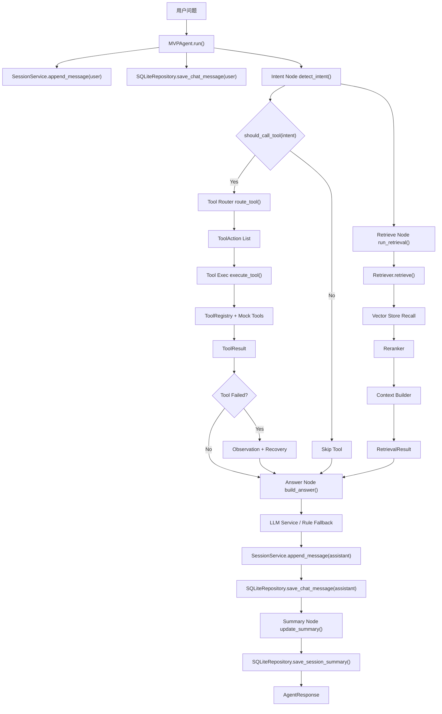
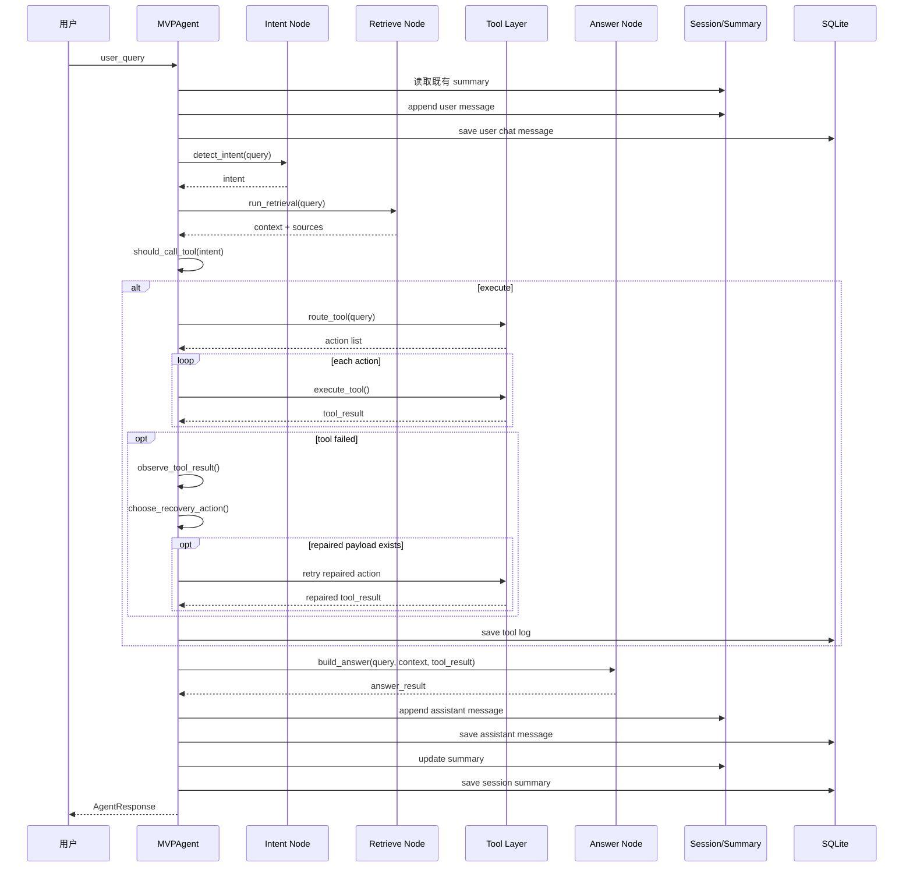
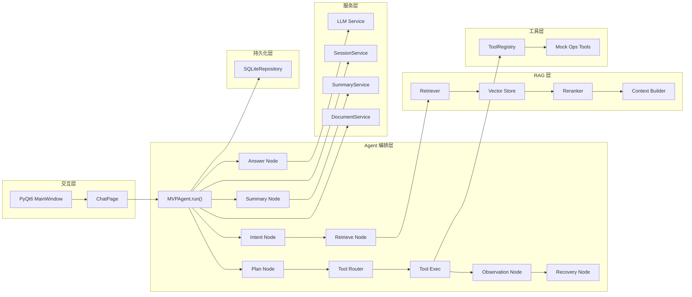

# AI_Agent_First Agent 当前架构理解与执行计划

## 1. 文档目的

本文档聚焦当前项目中的 Agent 部分，基于真实代码而不是理想方案，回答三个问题：

1. 当前 Agent 到底是如何工作的
2. 当前 Agent 离“可持续扩展的任务型 Agent”还差什么
3. 下一阶段应如何拆分任务并推进实现

这份说明主要对应这些实现：

- `app/agent/graph.py`
- `app/agent/nodes/*.py`
- `app/rag/retriever.py`
- `app/tools/registry.py`
- `app/services/llm_service.py`
- `app/services/session_service.py`

---

## 2. 一句话结论

当前项目里的 Agent 已经具备一个可运行的最小闭环：

**用户输入 -> 意图识别 -> RAG 检索 -> 条件工具调用 -> LLM/规则回答 -> 摘要更新 -> 持久化返回**

经过持续落地后，它已经从纯顺序变量编排升级为**显式 `AgentState` 驱动的顺序式 MVP Agent**，但仍不是严格意义上的 LangGraph 状态机 Agent。  
也就是说，现在已经可以演示“知识问答 + 单步/多步工具调用 + 会话记忆 + 节点轨迹 + 失败观察/恢复 + 可修复参数错误自动重试”的闭环，但还没有形成真正的：

- 多步计划执行
- 复杂任务的重规划

---

## 3. 当前 Agent 总体结构

---

## 4. 真实代码中的职责拆分

### 4.1 `MVPAgent`

入口文件：`app/agent/graph.py`

当前 `MVPAgent.run()` 实际承担了编排器的职责，并通过 `AgentState` 记录关键中间状态：

- 读取已持久化摘要并回填到内存会话
- 保存用户消息
- 调用意图识别
- 触发检索
- 判断是否需要工具
- 执行工具并记录日志
- 触发回答生成
- 保存回答
- 更新摘要
- 返回 UI 所需的响应对象
- 返回节点轨迹、计划路线、工具选择、观察记录和恢复动作

这意味着当前的“graph”仍然更像是一个**状态驱动的顺序编排函数**，而不是图结构运行时。

### 4.2 Intent Node

文件：`app/agent/nodes/intent_node.py`

当前意图识别是规则式的，输出三类：

- `knowledge`
- `troubleshoot`
- `execute`

特点：

- 对“解释 / 原因 / 怎么排查 / 先看什么”等表达做了保护，避免误触发工具
- 对“重启 / 执行 / check / 查询状态”等偏执行表达走 `execute`
- 对“报错 / 故障 / 失败”优先判为 `troubleshoot`

这是当前 Agent 比较稳定的一层，因为它明确抑制了“解释类问题误调工具”的行为。

### 4.3 Retrieve Node

文件：`app/agent/nodes/retrieve_node.py`

这里只是一个轻包装，实际逻辑在 `Retriever.retrieve()`：

- 从 repository 读取 chunks
- 调用 vector store 召回
- 调用 reranker 精排
- 调用 context builder 组装上下文和来源

所以严格说，当前的检索复杂度主要不在 Agent 节点层，而在 RAG 层。

### 4.4 Plan Node

文件：`app/agent/nodes/plan_node.py`

当前 `plan_node` 已经从一个布尔判断升级为计划分流：

- `knowledge` -> `answer`
- `troubleshoot` -> `diagnose`
- `execute` -> `tool`

这说明现在的“Plan”已经可以表达基础任务路线，但还不是完整的多步规划器。

它目前没有做到：

- 将复杂任务拆成子步骤
- 判断先检索再执行还是先执行再总结
- 控制多工具顺序
- 失败后改计划

### 4.5 Observation + Recovery Node

文件：

- `app/agent/nodes/observation_node.py`
- `app/agent/nodes/recovery_node.py`

当前 Observation/Recovery 是最小骨架：

- 工具失败时记录结构化观察
- 根据 `retryable` 判断恢复动作
- 对不可重试失败选择 `degrade_to_answer`
- 对带 `repaired_payload` 的可修复参数错误选择 `retry_repaired_action`
- 自动用修复后的 action 重新执行一次
- 对 `degrade_to_answer` 与 `retry_later` 执行最小重规划并中止剩余 action
- 对特定失败提示支持 `fallback_to_remaining_actions`，继续执行剩余可用 action
- 将节点轨迹写入 `AgentResponse.node_trace`

这让系统已经具备基础失败可观测性、一次性参数修复重试能力、最小可执行重规划，以及受控的“替代 action 续行”能力，但还没有做到复杂任务级重规划。

### 4.6 Tool Router + Tool Exec

文件：

- `app/agent/nodes/tool_router_node.py`
- `app/agent/nodes/tool_exec_node.py`
- `app/tools/registry.py`

当前工具调用已经支持 action list 骨架：

- Router 根据关键词提取一个或多个 `ToolAction`
- Exec 按 action 顺序从 registry 取出工具并执行
- ToolRegistry 负责默认工具注册

当前已具备的优点：

- 路由逻辑独立
- 执行逻辑独立
- 工具注册表独立
- 工具输出结构统一
- 复合请求可以顺序执行多个工具
- 已可跑通“查状态 -> 查日志 -> 总结根因”的固定顺序链路
- UI 可以展示 actions 数量和工具名列表

但还缺少：

- 工具结果驱动下一步计划
- 计划层面对工具结果的再消费

### 4.7 Answer Node

文件：`app/agent/nodes/answer_node.py`

当前回答生成统一通过 `llm_service.generate_answer_result()` 完成：

- 有远程 OpenAI 兼容模型时走真实模型
- 否则走本地规则 fallback

这层的价值是把“回答生成能力”从 Agent 主流程里解耦出来了。

### 4.8 Summary Node

文件：`app/agent/nodes/summary_node.py`

摘要节点是当前长对话能力的关键补丁：

- 用 `SummaryService` 更新会话摘要
- 再落库到 SQLite

这让当前系统已经具备“最近消息 + 历史摘要”的基础记忆结构。

---

## 5. 当前 Agent 的真实运行模式

### 5.1 顺序执行图

### 5.2 当前模式的优点

- 链路短，容易调试
- 行为稳定，可预测
- 对 UI 和评测友好
- 每一层都已经有相对清晰的职责边界
- 节点轨迹、计划路线、恢复动作已经可返回到桌面端

### 5.3 当前模式的限制

- 不能表达复杂任务计划
- 不能做可回环的自动修复
- 不能做多步骤 Agent 操作
- 不能把复杂任务拆成 action 列表

---

## 6. 当前 Agent 架构分层图

---

## 7. 当前完成度判断

### 7.1 已完成能力

- 单轮知识问答闭环
- 条件化工具调用闭环
- 来源引用返回
- 工具日志持久化
- recent messages + summary 基础记忆
- UI 状态透出 backend 信息
- UI 状态透出 Agent plan 与 node trace
- 工具失败时记录 observation 与 recovery action
- 多工具 action list 顺序执行
- 可修复参数错误自动重试一次
- `degrade_to_answer` / `retry_later` 下的最小重规划中止
- `fallback_to_remaining_actions` 下的剩余 action 续行
- 评测报告支持 Agent path 对比维度
- 可评测、可测试、可演示

### 7.2 半完成能力

- Agent 计划层
  现状：已有 `answer / diagnose / tool` 分流，但还不是多步规划器
- Tool 调用修复闭环
  现状：已有失败观察、降级动作和一次性 repaired action 重试
- 多工具任务
  现状：已有基于规则的 action list 顺序执行，并支持固定顺序的“状态 -> 日志 -> 总结”链路，但还不是模型驱动的任务分解
- 长对话压缩
  现状：有摘要更新，但还不是“任务导向记忆”

### 7.3 未完成能力

- 真正的 LangGraph/StateGraph 编排
- 多步计划执行
- 失败后的自动重规划
- 观察节点与行动节点循环执行

---

## 8. 关键架构判断

这里有一个非常重要的判断：

### 当前项目的 Agent 能做什么

它更适合处理：

- 知识型问答
- 排障建议型问题
- 单步执行型请求
- 固定顺序的多步运维请求

例如：

- “Redis 内存压力先看什么”
- “MySQL 慢查询应该检查哪些日志”
- “请重启 redis 服务”
- “先检查 Redis 状态，再查 timeout 日志，最后给我总结根因”

### 当前项目的 Agent 暂时不适合什么

它还不适合处理真正的复合任务，例如：

- “先检查 Redis 状态，再查最近错误日志，如果异常再给我总结根因”
- “对 Kubernetes Pod 重启问题先检索知识库，再执行日志检查，再输出步骤化建议”
- “根据上轮失败结果自动改参数重试”

原因不是模型不够强，而是**Agent 编排结构还没有进入任务型状态机阶段**。

---

## 9. 下一阶段推荐目标

下一阶段不建议一下子追求“大而全 Agent”，而是按下面顺序推进：

### 阶段 A：把当前顺序式 Agent 显式状态化

目标：

- 引入 `AgentState`
- 让每个节点读写统一状态
- 让每次执行过程可观测

这是后续一切多步能力的基础。

### 阶段 B：把 Plan Node 从布尔判断升级成任务分流器

目标：

- 区分知识问答、排障流程、执行流程
- 支持“检索后直接回答”与“检索后再调用工具”的差异路径

### 阶段 C：补 Observation / Recovery 闭环

目标：

- 工具失败后记录结构化观察结果
- 允许重试、改参、降级回答

### 阶段 D：支持多工具任务

目标：

- 一个请求可触发多个动作
- 每一步有中间状态和结果
- 最终答案按任务过程组织输出

---

## 10. Agent 下一阶段执行计划

# Plan

围绕当前顺序式 `MVPAgent`，下一阶段的目标不是推翻重写，而是把现有稳定链路逐步状态化、可视化、任务化。整体策略是先抽出显式 `AgentState` 和运行轨迹，再升级计划层与工具闭环，最后再考虑真正的 LangGraph 化。

## Scope
- In: `app/agent/graph.py`、`app/agent/nodes/*`、工具编排、状态对象、Agent 可观测性、桌面端状态展示、对应测试与文档
- Out: RAG 主算法重写、Milvus 继续深挖、模型 provider 切换、权限系统、真实生产工具接入

## Action items
[x] 梳理并新增 `app/agent/state.py`，把当前隐式流程变量统一收敛为显式 `AgentState`
[x] 重构 `app/agent/graph.py`，让 `MVPAgent.run()` 按“读状态 -> 节点执行 -> 写状态”的方式组织，而不是直接在主函数里串联所有细节
[x] 升级 `plan_node.py`，把当前 `should_call_tool()` 扩展为任务分流器，明确区分 `knowledge`、`troubleshoot`、`execute` 的执行路径
[x] 新增 Observation/Recovery 节点，承接工具执行结果、失败原因、是否重试和最终降级回答
[x] 改造 `tool_router_node.py` 和 `tool_exec_node.py`，支持结构化 action 列表与多步工具任务的最小骨架
[x] 为 Agent 增加运行轨迹输出，例如节点序列、工具选择、失败原因和摘要更新结果，便于 UI 与评测展示
[x] 扩展桌面端，让其显式展示当前 Agent 所处路径、是否调用工具、用了哪些节点
[x] 扩展评测报告，让其记录 Agent plan、node trace、selected tool 和 recovery action
[x] 用 TDD 为自动重试补测试，优先覆盖 `tests/test_tools_and_agent.py`、`tests/test_ui_behavior.py`
[x] 用 TDD 为评测报告 Agent path 维度补测试，优先覆盖 `tests/test_evaluation_runner.py`
[x] 生成第二版 Agent 架构图和执行说明，确保文档与代码同步，便于后续继续判断是否引入真正的 LangGraph

## Open questions
- 下一阶段是否要先做“显式状态机但仍不用 LangGraph”，还是直接切到 LangGraph `StateGraph`
- 多工具任务第一版是否只支持固定顺序，例如“查状态 -> 查日志 -> 总结”
- Agent 运行轨迹是优先展示到桌面端 UI，还是优先写入评测和日志体系

---

## 11. 推荐拆分顺序

为了降低改造风险，建议按下面顺序做：

### 11.1 第一批

- `state.py`
- `graph.py` 状态化
- `plan_node.py` 升级

这一批解决的是“能不能把 Agent 过程显式化”。

### 11.2 第二批

- `observation_node.py`
- `recovery_node.py`
- `tool_router_node.py` 结构化输出

这一批解决的是“工具链路能不能形成闭环”。

### 11.3 第三批

- 多工具 action 列表
- UI 轨迹展示
- 评测报告增加 Agent path 维度

这一批解决的是“Agent 是否真正进入可分析、可比较、可扩展阶段”。

---

## 12. 建议你如何理解当前 Agent

你可以把当前系统理解成：

- **RAG 已经是主功能层**
- **Agent 目前是决策薄层**
- **Tool Calling 目前是单步动作层**
- **Summary 是补足多轮能力的记忆层**

所以现在的关键不是继续把 Agent 写得更复杂，而是先把它从“顺序函数”升级成“状态驱动的任务编排器”。

这一步一旦做完，后面无论你继续接：

- 更复杂的工具链
- 更真实的运维动作
- 更长链路的排障任务
- 更强的评测框架

整体架构都会更稳。

---

## 13. 当前评测可观察维度

当前评测报告已经可以同时观察三类信息：

- RAG 效果：source hit、top1 source、keyword hit
- Backend 对比：retrieval、embedding、vector store、reranker
- Agent path 对比：plan route、plan steps、selected tool、recovery action、node trace、tool actions
- 重规划观察：replan steps 与 recovery 后执行终止/续行行为

这意味着后续评测不再只回答“答案像不像”，还可以回答：

- 这个问题走的是知识回答、排障诊断还是工具执行
- 工具是否被正确选择
- 计划步骤是否符合预期执行路径
- 多工具 action 是否被记录
- 参数错误是否触发了 recovery
- recovery 后是否进入了正确的 replan 步骤
- 不同 Agent 路径下的通过率是否稳定
