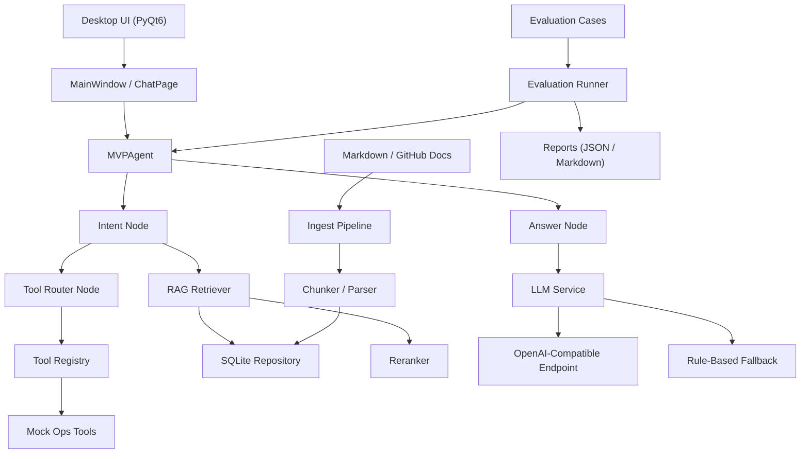

# AI Agent First Current Architecture And Testing

## 1. Project Positioning

This project is a local desktop AI Agent MVP focused on:

- GitHub-derived knowledge base ingestion
- RAG retrieval and source attribution
- Intent recognition and tool routing
- OpenAI-compatible LLM access with fallback
- Desktop-side visual interaction, logs, and evaluation

The current repository is no longer only a static scaffold. It already includes:

- a runnable desktop client
- a local document ingestion pipeline
- a GitHub-based knowledge/document generation pipeline
- an evaluation set and report generation path
- real LLM integration through an OpenAI-compatible endpoint

## 2. Architecture Diagram

## 3. Core Module Responsibilities

- `app/config`
  Loads runtime settings, project-local `.env`, and Windows persistent environment variables.

- `app/rag`
  Handles markdown parsing, chunking, ingest, retrieval, and reranking.

- `app/repositories`
  Uses SQLite to persist documents, chunks, chat messages, and tool logs.

- `app/agent`
  Orchestrates query flow through intent recognition, retrieval, tool decision, and answer generation.

- `app/tools`
  Provides mock operational tools such as service status check, log search, and restart simulation.

- `app/services/llm_service.py`
  Connects to OpenAI-compatible `/chat/completions`, supports fallback, and now includes automatic retry for transient relay failures.

- `app/ui`
  Provides the PyQt6 desktop UI, including source display, tool log panel, async request handling, streaming-like rendering, cancel, timeout, and retry interaction.

- `app/datasets` and `app/evaluation`
  Build GitHub-derived knowledge documents and benchmark cases, and run system-effect evaluation.

- `scripts`
  Exposes runnable entry points for ingestion, desktop run, demo run, dataset build, and evaluation.

## 4. Current Capability Set

At the current stage, the project can already do the following:

### 4.1 Knowledge Base And Retrieval

- Ingest local markdown documents from `data/docs/`
- Parse heading structure and split long sections into chunks
- Persist chunk metadata and content into SQLite
- Retrieve context by keyword overlap and reranked technical stack terms
- Return source references together with answers

### 4.2 Agent And Tool Flow

- Distinguish explanatory questions from operational requests
- Avoid accidental tool execution for pure explanation or troubleshooting questions
- Route eligible requests to mock tools
- Record tool execution logs for UI and later review

### 4.3 Desktop Interaction

- Show document list, chat history, sources, and tool logs in one window
- Execute chat requests asynchronously to avoid blocking the UI
- Render response text progressively
- Support cancel, timeout status, and retry interaction
- Display current LLM backend state in the UI

### 4.4 Real LLM Access

- Use OpenAI-compatible endpoints via configurable `base_url`
- Support model selection such as `gpt-5.2`
- Fall back to local rule-based answers when remote calls fail
- Retry transient relay failures such as timeout and disconnect

### 4.5 Dataset And Evaluation

- Harvest high-signal GitHub issue/discussion content into normalized markdown documents
- Generate deterministic evaluation cases from the same provenance
- Run batch evaluation and export JSON/Markdown reports

## 5. Current Directory-Level Flow

### Runtime flow

1. `scripts/run_desktop.py`
2. `app.main.bootstrap_application()`
3. `AppSettings` loads local config
4. `MVPAgent` + `SQLiteRepository` + `LLMService` + UI are initialized
5. UI sends user query to agent
6. Agent performs retrieval, optional tool routing, and answer generation
7. UI renders answer, sources, and logs

### Data flow

1. `scripts/build_github_dataset.py`
2. normalize GitHub content into markdown docs
3. write docs to `data/docs/github/`
4. write test cases to `evaluation/cases/github_cases.json`
5. `scripts/run_eval.py`
6. generate `evaluation/reports/eval_report.json` and `evaluation/reports/eval_report.md`

## 6. Verified Evaluation Metrics

Based on the current repository report in `evaluation/reports/eval_report.md`:

- Case count: `100`
- Passed: `97`
- Pass rate: `97.00%`
- Source hit rate: `98.00%`
- Top1 source accuracy: `97.00%`
- Keyword hit rate: `100.00%`

This indicates that the current project is not only runnable, but already has a relatively stable offline benchmark loop for RAG retrieval quality.

## 7. Real Test Examples

The following examples are based on actual end-to-end verification performed against the current project state on `2026-04-23`.

### Example A: Real relay-backed LLM verification

Runtime configuration confirmed during validation:

- Backend: `openai-compatible:gpt-5.2`
- Base URL: `https://api1.oai1.online/v1`
- API key loaded: `True`
- Retry attempts: `2`

#### Query 1

- Question: `Redis OOM 时应该优先检查哪些指标和配置？`
- Remote result: first request timeout, retry timeout
- Final behavior: fallback answer returned
- Interpretation: relay instability still exists for some requests even after retry

#### Query 2

- Question: `MySQL 日志里频繁出现 aborted connection，通常先怎么排查？`
- Remote result: first request timeout, second request succeeded
- Final behavior: real `gpt-5.2` answer returned
- Key output characteristics:
  - identified likely causes such as client disconnect, network/NAT timeout, connection pool misuse, and MySQL timeout/resource pressure
  - returned structured troubleshooting steps instead of fallback template

#### Query 3

- Question: `Kubernetes Pod 反复 CrashLoopBackOff，第一轮排查步骤应该是什么？`
- Remote result: first request succeeded
- Final behavior: real `gpt-5.2` answer returned
- Key output characteristics:
  - gave a staged diagnosis flow around `kubectl describe`, `kubectl logs --previous`, Secret checks, probes, and resource checks
  - included actionable commands and operational cautions

### Example B: Offline benchmark report

The repository also includes a real generated benchmark set and report:

- Cases file: `evaluation/cases/github_cases.json`
- Report file: `evaluation/reports/eval_report.md`

Representative benchmark outcome:

- `100` evaluation cases executed
- `97` cases passed
- retrieval and keyword coverage remained high

## 8. Current Limitations

The project is usable as an MVP, but still has several practical limitations:

- remote relay stability is not yet guaranteed
- fallback answers are still simpler than real LLM answers
- current tool execution is still mock-oriented rather than production ops integration
- real streaming from provider responses is not yet implemented; the UI currently performs progressive local rendering after response arrival

## 9. Recommended Next Steps

- expose retry count and backoff through settings
- mark remote-answer vs fallback-answer explicitly in UI
- add provider-side request diagnostics to help relay troubleshooting
- continue replacing mock tools with real safe tool adapters
- expand evaluation set with more live and adversarial cases
