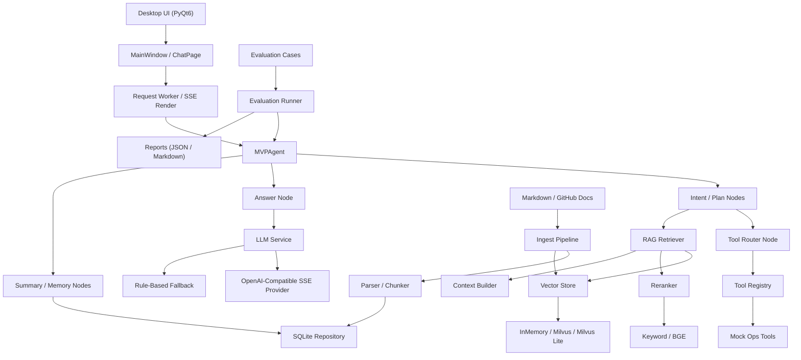

# AI Agent First Current Architecture And Testing

## 1. Project Positioning

This project is a local desktop AI Agent MVP focused on:

- GitHub-derived knowledge base ingestion
- RAG retrieval and source attribution
- Intent recognition and tool routing
- OpenAI-compatible LLM access with fallback
- Desktop-side visual interaction, logs, and evaluation

The current repository is no longer only a static scaffold. It already includes:

- a runnable desktop client
- a local document ingestion pipeline
- a GitHub-based knowledge/document generation pipeline
- an evaluation set and report generation path
- real LLM integration through an OpenAI-compatible endpoint
- optional Milvus Lite local vector retrieval
- local BGE reranking and end-to-end latency telemetry

## 2. Architecture Diagram

## 3. Core Module Responsibilities

- `app/config`
  Loads runtime settings, project-local `.env`, and Windows persistent environment variables.

- `app/rag`
  Handles markdown parsing, chunking, ingest, retrieval, reranking, context building, and optional Milvus/Milvus Lite vector recall.

- `app/repositories`
  Uses SQLite to persist documents, chunks, chat messages, session summaries, and tool logs.

- `app/agent`
  Orchestrates query flow through intent recognition, retrieval, tool decision, answer generation, and summary memory updates.

- `app/tools`
  Provides controlled operational tool adapters for service status check, log search, and dry-run/real restart execution.

- `app/services/llm_service.py`
  Connects to OpenAI-compatible `/chat/completions`, supports SSE streaming, fallback, automatic retry for transient relay failures, and provider diagnostics telemetry.

- `app/services/session_service.py` and `app/services/summary_service.py`
  Maintain the recent-message window and compact session summary used by long-dialog memory.

- `app/ui`
  Provides the PyQt6 desktop UI, including source display, compact knowledge summary, tool log panel, async request handling, provider-stream rendering, cancel, timeout, retry, and explicit diagnostics panels.

- `app/datasets` and `app/evaluation`
  Build GitHub-derived knowledge documents and benchmark cases, and run system-effect evaluation.

- `scripts`
  Exposes runnable entry points for ingestion, desktop run, demo run, dataset build, and evaluation.

## 4. Current Capability Set

At the current stage, the project can already do the following:

### 4.1 Knowledge Base And Retrieval

- Ingest local markdown documents from `data/docs/`
- Parse heading structure and split long sections into chunks
- Persist chunk metadata and content into SQLite
- Optionally upsert dense vectors into Milvus or Milvus Lite
- Retrieve context through vector recall plus reranking
- Support pluggable vector store recall, with `milvus / milvus-lite / in-memory` fallback paths
- Support BGE reranking with query/content truncation and latency tuning
- Record `retrieval / coarse_rerank / bge_rerank / context_build` stage latencies
- Return source references together with answers

### 4.2 Agent And Tool Flow

- Distinguish explanatory questions from operational requests
- Avoid accidental tool execution for pure explanation or troubleshooting questions
- Route eligible requests to controlled local tool adapters
- Record tool execution logs for UI and later review

### 4.3 Desktop Interaction

- Show document list, chat history, sources, and tool logs in one window
- Execute chat requests asynchronously to avoid blocking the UI
- Prefer provider SSE chunks for progressive response rendering
- Support cancel, timeout status, and retry interaction
- Display current LLM backend state in the UI
- Display first-token latency, total latency, provider diagnostics, RAG stage telemetry, and current session summary

### 4.4 Real LLM Access

- Use OpenAI-compatible endpoints via configurable `base_url`
- Support model selection such as `gpt-5.2`
- Fall back to local rule-based answers when remote calls fail
- Retry transient relay failures such as timeout and disconnect
- Expose retry attempts and retry backoff through runtime settings
- Mark each completed answer as `remote` or `fallback` in the desktop interaction state
- Surface provider-side diagnostics in the desktop request state, including `timeout`, `disconnect`, `http_401`, `http_429`, and attempt count
- Support real `/chat/completions` SSE streaming when the upstream provider is compatible
- Compact long context before provider calls to reduce prompt size and improve first-token latency

### 4.5 Dataset And Evaluation

- Harvest high-signal GitHub issue/discussion content into normalized markdown documents
- Generate deterministic evaluation cases from the same provenance
- Run batch evaluation and export JSON/Markdown reports

### 4.6 Session Memory

- Keep recent user/assistant messages in `SessionService`
- Merge prior summary, latest user question, and latest answer into a compact session summary
- Persist session summaries in SQLite so a restarted runtime can restore long-dialog context
- Return the updated summary from `MVPAgent.run()` for later UI display or evaluation inspection

## 5. Current Directory-Level Flow

### Repository layout

- `app/agent`
  Graph orchestration and node-level execution flow.

- `app/rag`
  Retrieval pipeline, vector store abstraction, Milvus Lite integration, and reranking.

- `app/services`
  LLM access, session memory, summary generation, and document service facade.

- `app/ui`
  Desktop shell, chat page, docs page, logs page, and reusable widgets.

- `data/docs`
  Knowledge base source markdown files.

- `evaluation/cases` and `evaluation/reports`
  Evaluation set and generated reports.

### Runtime flow

1. `scripts/run_desktop.py`
2. `app.main.bootstrap_application()`
3. `AppSettings` loads local config
4. `MVPAgent` + `SQLiteRepository` + `LLMService` + UI are initialized
5. UI sends user query to agent
6. Agent performs retrieval, optional tool routing, and answer generation
7. Agent updates recent messages and persisted session summary
8. UI renders answer, sources, and logs

### Data flow

1. `scripts/build_github_dataset.py`
2. normalize GitHub content into markdown docs
3. write docs to `data/docs/github/`
4. write test cases to `evaluation/cases/github_cases.json`
5. `scripts/run_eval.py`
6. generate `evaluation/reports/eval_report.json` and `evaluation/reports/eval_report.md`

## 6. Verified Evaluation Metrics

Based on the current repository report in `evaluation/reports/eval_report.md`:

- Case count: `100`
- Passed: `97`
- Pass rate: `97.00%`
- Source hit rate: `98.00%`
- Top1 source accuracy: `97.00%`
- Keyword hit rate: `100.00%`

This indicates that the current project is not only runnable, but already has a relatively stable offline benchmark loop for RAG retrieval quality.

## 7. Real Test Examples

The following examples are based on actual end-to-end verification performed against the current project state on `2026-04-26`.

### Example A: Runtime validation

Runtime validation output confirmed:

- `retrieval_backend=milvus`
- `reranker_backend=bge`
- `llm_backend=openai-compatible:gpt-5.2`
- `llm_remote_configured=true`
- `llm_sse_supported=true`

### Example B: Real agent smoke query

- Query: `Redis OOM 怎么排查 maxmemory slowlog`
- Execution path:
  - `load_memory`
  - `persist_user_message`
  - `intent`
  - `retrieve`
  - `plan`
  - `answer`
  - `persist_assistant_message`
  - `summary`
- Result highlights:
  - `answer_backend='remote'`
  - `provider_status='success'`
  - `provider_attempts=1`
  - `retrieval_backend='milvus'`
  - `reranker_backend='bge'`
  - `retrieval_stage_latency_ms={'retrieval': 8, 'coarse_rerank': 0, 'bge_rerank': 3061, 'context_build': 0}`
- `first_token_latency_ms=29544`
- `total_latency_ms=29544`

Interpretation:

- the full chain was not just configuration-correct, but actually executed through real retrieval, real BGE reranking, real remote LLM answering, and session-summary persistence
- the dominant latency at this stage is still remote first token time, while local BGE reranking also contributes a measurable cost

### Example C: Repeated-query latency improvement

For the same query `Redis OOM 怎么排查 maxmemory slowlog`, a repeated real run after the cache-aware reranker change showed:

- Run 1:
  - `first_token_latency_ms=21890`
  - `bge_rerank=3111ms`

- Run 2:
  - `first_token_latency_ms=18426`
  - `bge_rerank=0ms`

Interpretation:

- repeated or retry-style queries now benefit from local BGE score caching
- this does not remove provider-side latency, but it meaningfully reduces the local pre-answer path

### Example D: Offline benchmark report

The repository also includes a real generated benchmark set and report:

- Cases file: `evaluation/cases/github_cases.json`
- Report file: `evaluation/reports/eval_report.md`

Representative benchmark outcome:

- `100` evaluation cases executed
- `97` cases passed
- retrieval and keyword coverage remained high

## 8. Current Limitations

The project is usable as an MVP, but still has several practical limitations:

- remote relay stability is not yet guaranteed
- first-token latency remains high under some relay/provider conditions
- local BGE reranking can still consume seconds on CPU for first-seen queries
- fallback answers are still simpler than real LLM answers
- controlled tools still need more production-grade adapters beyond status, log search, and gated restart
- current dense embedding is still the lightweight hash implementation rather than a production embedding model

## 9. Recommended Next Steps

- continue replacing mock tools with real safe tool adapters
- optimize first-token latency and relay retry strategy
- replace hash embedding with a stronger dense embedding backend
- expand evaluation set with more live and adversarial cases
